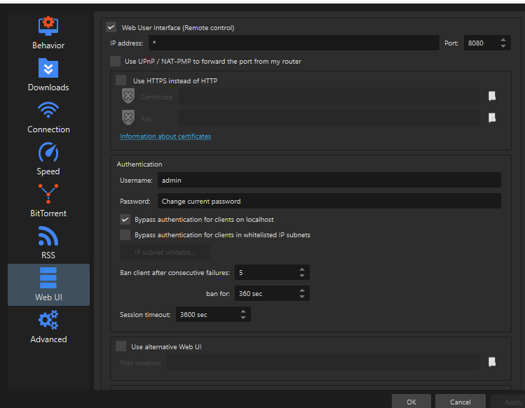

# NHentai Torrent exporter
Simple, crude, straightforward script to export your favourites gallery using QBitTorrent client (and it's WebAPI).
Recommended to run under Python 3.10.

> [!WARNING]  
> I've only ran this on Windows 10, using QBitTorrent client version 4.4.3.1. I have no idea if / how it will work on any other platform. You're welcome to test though.

## Initial setup
Before even starting it, ensure you have QBitTorrent (specifically this torrent client) installed and WebAPI in it enabled, as such:  


Exporter assumes you have either `admin`:`adminadmin` credentials or you have `Bypass authentication for clients on localhost` enabled, as on screenshot.

1. Clone this repo via `git clone https://github.com/SanctusAnimus/Nhentai-Torrent-exporter.git`, or download-unzip directly
2. In repo folder create `config.env`, and fill it as follows:
    ```env
    FAV_INDEX_DELAY=2 # seconds between fetching next page. the smaller this is, the faster indexing is
    FAV_TORRENT_DELAY=1 # seconds between adding next torrent entry. 
    
    UNKNOWN_AUTHOR_NAME='Unknown Author'
    
    SESSION_ID=YOUR SESSION ID
    CSRF_TOKEN=YOUR CSRF TOKEN
    CF_CLEARANCE=YOUR CF CLEARANCE
    USER_AGENT='YOUR USER AGENT, PAY ATTENTION TO SINGLE QUOTES'
    ```
    I'm not exactly sure what are the rate limits with proper cookies set, values provided by default are conservative - tested it myself and exported 1400 entries.  
    For bigger galleries you might want to try reducing them a bit - floats are supported here (say, 0.5).
    
    To get csrftoken, sessionid and cf_clearance, first login to your nhentai account in web browser, then:  
    (Chrome) ⋮ — More tools — Developer tools — Application — Storage — Cookies — https://nhentai.net  
    (Firefox) ☰ — Web Developer — Web Developer Tools — Storage — Cookies — https://nhentai.net  

    > [!IMPORTANT]  
    > `cf_clearance` is only set if you've passed captcha during your session - which might not be the case for you all the time.
    > If you don't see it in the Storage, erase the line containing `CF_CLEARANCE` from config. 
    > It being unset however might cause an error at some point, to which you'll need to switch back to your browser and reload the page to trigger captcha there, pass it and fetch clearance token in the same way described above

    To get user agent, navigate into `Network`, find the very first request, click, scroll down to `Request Headers`:  
    

    You can also find your cookies there.

3. (Optional, but preferred) Create python virtual environment from CMD via
    ```
    python -m venv .venv
    ```
    And activate it with this if you're running in terminal
    ```
    .venv\Scripts\activate.bat
    ```
    In Powershell, use `.venv\Scripts\activate.ps1`  

4. Install dependencies via  
```pip install -r requirements.txt```  
You should be good to go.

## Exporting and downloading
Assuming you've done all the setup:  
To index your favourites and download them afterwards  
```
python main.py export
```
This will scan your favourites gallery page by page, then save it into index files (`fav_ids.txt` as a list of ids and names for every entry, and `fav_by_author.txt` as the same list grouped by author name)  
By default it will proceed to downloading all entries from index immediately.  
If you just want to get ids and names, you can skip torrents via  
```
python main.py export -st
```

If you have your index files, you can start torrents from them at any time via
```
python main.py download_indexed
```

Index file defaults to `fav_by_author.txt`, but you can change it via `--index-file <your name>.txt`
